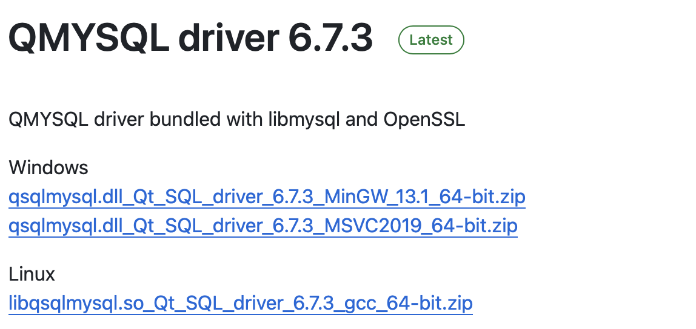

# Mac Qt6配置mysql数据库驱动

### 1.windows、linux驱动链接
[windows、linux驱动链接](https://github.com/thecodemonkey86/qt_mysql_driver/releases)

下载对应版本



## 2.编译mac Qt6 mysql8驱动
#### [1]使用QtMaintenance下载对应Qt版本的源码
#### [2]选择添加或移除组件
#### [3]选择Qt目录中的Source选项进行下载
#### [4]下载完成 拷贝qtbase到单独的目录中
#### [5]使用brew安装Mysql客户端 ```brew install mysql-client@8.0```
#### [6]将```/opt/homebrew/opt/mysql-client@8.0/include```和```/opt/homebrew/opt/mysql-client@8.0/lib```拷贝到qtbase同级目录
#### [7]使用Qt Creator打开```qtbase/src/plugins/sqldrivers/CMakeLists.txt```
#### [8]打开.cmake.conf设置mysql的路径
```cmake
set(FEATURE_sql_mysql ON)
set(MySQL_INCLUDE_DIR "/Users/xxx/qt_projects/QSqlMysql/mysql_dev/include/mysql")
set(MySQL_LIBRARY "/Users/xxx/qt_projects/QSqlMysql/mysql_dev/lib/libmysqlclient.dylib")
```
#### [9]编译当前打开的项目
#### [10]然后进入到/qtbase/src/plugins/sqldrivers/build/Qt_6_7_2_for_macOS-Release/plugins路径,复制libqsqlmysql.dylib.dSYM和libqsqlmysql.dylib文件到Qt安装目录下的/Users/xxx/Qt/6.7.2/macos/plugins路径中
#### [11]将mysql动态库和静态库(libmysqlclient.a,libmysqlclient.dylib这两个文件位于brew安装的mysql客户端路径下/opt/homebrew/opt/mysql-client@8.0/lib)都拷贝到Qt安装目录(/Users/xxx/Qt/6.7.2/macos/bin)

## 3.在应用中使用mysql
```cpp
QT += sql

main.cpp
#include <QSqlDatabase>
#include <QSqlQuery>

QStringList drivers = QSqlDatabase::drivers();

foreach (QString driver, drivers)
{
    qDebug() << driver;
}

auto db = QSqlDatabase::addDatabase("QMYSQL");
db.setHostName("127.0.0.1");
db.setPort(3506);
db.setDatabaseName("mpool");
db.setUserName("root");
db.setPassword("123456");

if (!db.open())
{
    qDebug() << "mysql connection fail!";
}
else
{
    qDebug() << "connect to the db!";
}

QSqlQuery query;//query会自动关联打开的数据库连接

if (!query.exec(sql))
{
    qDebug() << "sel error:" << sql;
}
else
{
    while (query.next())
    {
        QString username = query.value("username").toString();

        qDebug() << "get username:" << username;
    }
}
```


